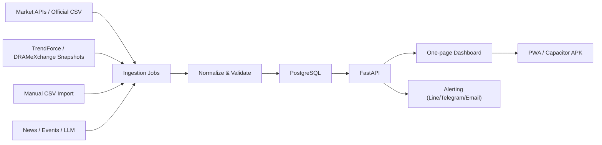

# 記憶體報價趨勢追蹤儀錶板 — 最終實作計畫 (Final Implement Plan)

日期：2026-06-23
版本：整併自 `implement_plan.md`（基礎架構與資料管線）與 `improve_plan.md`（功能與 UI/UX 強化）

目標：打造一頁式記憶體產業趨勢儀錶板，核心聚焦 Memory / NAND / Flash / HBM / SSD 報價與直接曝險公司，整合美股、日股、韓股、台股記憶體供應鏈個股，以及 DRAM/NAND 報價趨勢；提供 1 週 / 1 個月 / 3 個月 / 6 個月 / 1 年變化與 0–100 牛熊狀態評分。在穩定的資料管線之上，逐步升級為具備主動告警、AI 洞察與頂級視覺體驗的現代化金融科技終端。

> 注意：本系統用於產業追蹤與研究，不作為投資建議。價格資料需遵守各資料源授權、頻率限制與使用條款。

---

## 0. 整併原則與優先順序

1. **資料優先**：產品成敗主要在資料源可靠度與報價歷史累積。先做 Phase 0（驗證）+ Phase 1（MVP 管線），再談前端體驗與 APK。
2. **核心聚焦**：預設畫面、牛熊總分、熱力圖、排行榜一律以記憶體 / NAND / Flash 直接曝險為主。設備、材料、封測、載板、EDA、下游儲存只進「供應鏈觀察」分頁或輔助指標。
3. **強化分層融入**：UI/UX 升級併入 Phase 2；告警與進階分析併入 Phase 3；AI 與進階洞察獨立為 Phase 5。每項強化都對應一個可交付產出，不做無錨點的願景描述。
4. **合法合規**：所有爬蟲加上 User-Agent、重試、快取、頻率限制、來源記錄與失敗告警；付費資料以正式登入 / 匯出 / API 取得，不繞過限制。

---

## 1. 核心範圍

### 1.1 追蹤宇宙分層

- **Tier A**：核心 Memory / NAND / Flash / HBM / SSD，直接反映記憶體報價與供需，是預設視圖與牛熊總分主體。
- **Tier B**：記憶體控制 IC、介面 IP、模組、封測、載板、材料、記憶體相關設備，作為供應鏈廣度與領先/落後指標。
- **Tier C**：下游儲存系統、HDD、資料中心儲存、一般半導體設備/材料，僅作背景觀察，不直接納入核心牛熊分數。

重要邊界：
- 本儀錶板**不是**整個半導體大盤追蹤器。
- 全站文案與圖表標題避免泛稱「半導體景氣」，統一聚焦「記憶體 / NAND / Flash 趨勢」。

### 1.2 標的清單

**美股核心記憶體與儲存**
- Micron `MU`（DRAM、NAND、HBM）
- Sandisk `SNDK`（NAND Flash、SSD、flash storage）
- Western Digital `WDC`（2025 分拆 Sandisk 後偏 HDD/儲存，列需求端與儲存鏈觀察）

**美股控制 IC / IP / 連接**
- Silicon Motion / 慧榮 `SIMO`、Rambus `RMBS`、Marvell `MRVL`、Broadcom `AVGO`、Cadence `CDNS`、Synopsys `SNPS`

**美股設備 / 材料 / 封測 / 測試**
- `AMAT`、`LRCX`、`KLAC`、`TER`、`FORM`、`COHU`、`AMKR`、`ENTG`、`MKSI`、`ONTO`、`ACLS`、`VECO`、`PLAB`

**美股下游儲存需求觀察**
- Seagate `STX`、Pure Storage `PSTG`、Kingston（未上市，以新聞 / 通路價 / 模組報價替代）

**韓股核心記憶體**
- Samsung Electronics `005930.KS`、SK hynix `000660.KS`

**韓股設備 / 材料 / 封測 / 載板 / 測試觀察**
- `240810.KQ`、`319660.KQ`、`031980.KQ`、`084370.KQ`、`095610.KQ`、`222800.KQ`、`095340.KQ`、`058470.KQ`、`067310.KQ`、`036540.KQ`、`033640.KQ`、`131290.KQ`、`092870.KQ`、`357780.KQ`、`005290.KQ`、`014680.KS`、`104830.KQ`、`092070.KQ`、`093370.KS`

**日股核心記憶體**
- Kioxia Holdings `285A.T`（NAND Flash / SSD）

**日股設備 / 材料 / 光罩 / 載板 / 測試觀察**
- `6857.T`、`8035.T`、`7735.T`、`6146.T`、`6920.T`、`6361.T`、`7731.T`、`7751.T`、`6728.T`、`6590.T`、`3436.T`、`4063.T`、`4004.T`、`4186.T`、`4901.T`、`7741.T`、`4062.T`、`7911.T`、`7912.T`、`4401.T`、`4088.T`

**台股核心記憶體 / 控制 IC / 模組**
- 南亞科 `2408.TW`、華邦電 `2344.TW`、力積電 `6770.TW`、晶豪科 `3006.TW`、旺宏 `2337.TW`、群聯 `8299.TWO`、創見 `2451.TW`、威剛 `3260.TWO`、十銓 `4967.TWO`、宜鼎 `5289.TWO`、宇瞻 `8271.TWO`、品安 `8088.TWO`

**台股控制 IC / IP / 設計服務觀察**
- 安國 `8054.TWO`、創惟 `6104.TW`、力旺 `3529.TWO`、世芯-KY `3661.TW`

**台股封測 / 測試 / 探針卡 / 載板觀察**
- `6239.TW`、`8150.TW`、`2449.TW`、`6257.TW`、`8110.TW`、`3711.TW`、`3264.TWO`、`6515.TW`、`6510.TW`、`6223.TWO`、`6683.TWO`、`3037.TW`、`3189.TW`、`8046.TW`

**台股設備 / 材料觀察**
- 環球晶 `6488.TWO`、中美晶 `5483.TWO`、台勝科 `3532.TW`、家登 `3680.TWO`、弘塑 `3131.TWO`、辛耘 `3583.TW`、帆宣 `6196.TW`、漢唐 `2404.TW`、崇越 `5434.TWO`

### 1.3 報價趨勢標的

- **DRAM**：DDR2、DDR3、DDR4、DDR5 的 spot / contract / module price，含 LPDDR、GDDR。
- **NAND**：Flash spot、wafer spot、SSD contract/street price、eMMC/UFS。
- 優先使用 TrendForce / DRAMeXchange 類別資料；完整歷史若需付費，MVP 先每日保存公開快照，逐日累積自有歷史。

---

## 2. 資料源可行性

### 2.1 股票行情（混合來源，避免單一免費 API 失效）

| 市場 | 優先資料源 | 備援資料源 | 備註 |
|---|---|---|---|
| 台股上市 | FinMind `TaiwanStockPrice` / TWSE 官方 | yfinance / Stooq | FinMind 一套 API 處理上市、上櫃、興櫃；TWSE 提供 2010-01-04 起資料與 CSV。 |
| 台股上櫃 | FinMind `TaiwanStockPrice` / TPEx 官方 | yfinance | 群聯、威剛、宜鼎、宇瞻等以 TPEx 或 FinMind 統一處理。 |
| 美股 | Alpha Vantage free key、Stooq CSV 或 FinMind `USStockPrice` | yfinance | Alpha Vantage 免費 key 有流量限制；FinMind 美股覆蓋與額度需驗證。 |
| 日股 | Stooq / yfinance / 付費或券商 API | 手動匯入 CSV | Kioxia 與日本設備股需在 Phase 0 驗證日線與代號格式。 |
| 韓股 | KRX 資料頁或 yfinance / Stooq | 手動匯入 CSV | KRX 免費穩定 API 需驗證；MVP 先用 yfinance / Stooq。 |

### 2.2 FinMind 導入策略

建議作為 MVP 台股主要整合來源：
- `TaiwanStockInfo`：名稱、代碼、產業類別、市場別，用以確認清單與分類。
- `TaiwanStockTradingDate`：台股交易日曆，計算 1W/1M/3M/6M/1Y 期間與補資料。
- `TaiwanStockPrice`：台股日成交（上市/上櫃/興櫃），官方標示 `1994-10-01 ~ now`。
- `USStockInfo` / `USStockPrice`：美股清單與日線來源之一，Phase 0 驗證 MU、SNDK、WDC、SIMO、RMBS、MRVL、AVGO、AMAT、LRCX、KLAC、STX、PSTG 覆蓋率。
- 端點：`https://api.finmindtrade.com/api/v4/data`
- 認證：Bearer token，以環境變數 `FINMIND_TOKEN` 管理，不寫入程式碼或 repo。
- 額度：超過上限回傳 HTTP `402`；需加入用量檢查、快取與 retry/backoff。

MVP 優先順序：
1. 台股：FinMind `TaiwanStockInfo` + `TaiwanStockPrice`，TWSE/TPEx 備援與交叉驗證。
2. 美股：同時驗證 FinMind `USStockPrice`、Stooq、Alpha Vantage；FinMind 覆蓋足夠則減少 API 種類。
3. 日股：驗證 Stooq/yfinance 對 `285A.T`、`6857.T`、`8035.T` 可用性；不穩則手動 CSV / 券商 API。
4. 韓股：以 KRX/yfinance/Stooq 驗證為主。

### 2.3 TrendForce / DRAMeXchange（分級處理）

1. 公開頁可見即時/近期價格表（DRAM spot、NAND flash spot、module spot、wafer spot），適合「每日快照」。
2. 歷史圖表、完整 DDR2–DDR5、NAND 全品項、合約價與研究資料，多需會員或授權；付費帳號採正式登入/匯出/API，不繞過限制。
3. 無付費授權時，從上線日起每天記錄公開項目，逐步建立趨勢；歷史回補僅用合法可下載資料或人工 CSV。

### 2.4 新聞與事件資料源（為 Phase 5 AI 洞察鋪路）

- 第二階段加入 RSS / news API，用於解釋趨勢變化。
- 蒐集 Micron、SK Hynix、WD、Samsung、Kioxia 等大廠新聞、財報會議逐字稿來源清單。
- 維護「重大產業事件」資料表（減產、停電、需求爆發等），供事件疊加圖表使用。

### 2.5 資料更新機制（三種觸發）

1. **App/Web UI 開啟時自動檢查**：呼叫 API 檢查 `source_runs` 與最新資料時間；超過新鮮度門檻（股票日線 > 12h、報價快照 > 24h）顯示可更新狀態；限流風險高則提示手動更新。
2. **手動「更新」按鈕**：建立 `refresh_all` job，抓取所有最新資料；UI 顯示進度、成功/失敗來源、最後更新時間。
3. **每日背景更新**：台北時間 `01:00` 執行；當日尚未更新者標記 `not_ready`，下次開啟或手動更新時補抓；使用 APScheduler / Celery Beat。

更新安全規則：
- 所有 job 需 lock，避免手動與背景更新衝突。
- 優先增量更新，只抓最後成功日期之後資料。
- 各資料源獨立記錄狀態，單一失敗不中斷全部。
- 寫入 PostgreSQL 使用 upsert。
- 每次更新寫入 `source_runs`，含觸發來源：`startup`、`manual`、`scheduled_0100`。
- 失敗支援 retry/backoff，UI 顯示可讀錯誤訊息。

---

## 3. 系統架構

技術棧：
- **Backend**：Python FastAPI
- **Scheduler**：APScheduler 或 Celery Beat
- **Crawler**：requests/httpx + BeautifulSoup；必要時 Playwright
- **Database**：PostgreSQL（正式）；本機開發用 Docker Compose
- **Frontend**：React + Vite + TypeScript
- **Chart**：核心 ECharts / Recharts；核心趨勢圖評估整合 TradingView `lightweight-charts`（技術指標、滑順縮放平移）
- **AI（Phase 5）**：LLM API（Gemini 或 OpenAI），以環境變數管理金鑰
- **推播（Phase 3）**：Line Notify / Telegram Bot / Email
- **Mobile**：Android app 為正式支援目標；先 PWA 驗證，再用 Capacitor 打包 APK

服務埠：
- Backend/API：`3000`
- Web UI 入口：`8510`
- PostgreSQL：Docker Compose 容器內 `5432`，對外映射埠部署前確認

資料流：



---

## 4. 資料模型草案

- `instruments`：股票/報價品項主檔（市場、代號、分類、幣別、是否啟用）。
- `instrument_tags`：供應鏈標籤（`memory-maker`、`nand-controller`、`module-brand`、`equipment`、`material`、`backend-test`、`substrate`、`downstream-storage`、`tier-a/b/c`）。
- `instrument_score_config`：是否納入核心牛熊分數、廣度分數或僅觀察。
- `equity_prices`：股票 OHLCV 日線。
- `memory_quotes`：DRAM/NAND 報價快照（品項、high、low、average、change_pct、來源、抓取時間）。
- `trend_metrics`：預先計算 1W/1M/3M/6M/1Y 報酬、波動、均線、相對強弱。
- `market_scores`：牛熊分數、分項分數、狀態標籤。
- `source_runs`：每次抓取狀態、錯誤訊息、資料筆數。
- `refresh_jobs`：更新任務狀態（觸發來源、起訖時間、進度、lock key、成功/失敗統計）。

強化新增（Phase 3 / 5）：
- `alert_rules`：告警規則（指標、條件、閾值、渠道、啟用狀態）。
- `alert_events`：告警觸發記錄（時間、規則、當下數值、推播結果）。
- `news_items`：新聞/財報摘要（來源、標的、發布時間、LLM 情緒分數、關鍵字）。
- `market_events`：重大產業事件（日期、標題、描述、關聯標的，用於事件疊加圖）。
- `correlation_matrix`：個股與 NAND/DRAM 報價的滾動相關係數（標的、報價品項、窗格、係數、計算時間）。
- `user_layouts`：個人化版面佈局（可先存 LocalStorage，後端為選配）。

---

## 5. 牛熊市狀態評分

以 0–100 分呈現，五段狀態：
- 0–20 強熊、21–40 偏熊、41–60 中性、61–80 偏牛、81–100 強牛

分數組成：

| 模組 | 權重 | 說明 |
|---|---:|---|
| 記憶體報價動能 | 40% | DRAM、NAND、Flash、HBM、SSD 報價的 1W/1M/3M 漲跌與均線方向。 |
| 核心記憶體股價動能 | 25% | 僅 Tier A 與高直接曝險（MU、SNDK、Samsung、SK hynix、Kioxia、南亞科、華邦電、旺宏、群聯等）。 |
| 記憶體供應鏈廣度 | 10% | Tier A/B 記憶體直接相關股票站上 20D/60D 均線比例；設備/材料低權重輔助。 |
| 波動與回撤 | 15% | 波動越高、最大回撤越大則扣分。 |
| 相對強弱 | 10% | 記憶體籃子相對 Nasdaq、KOSPI、TAIEX 或 SOXX。 |

初版公式：

```text
score = 50
      + quote_momentum_score * 0.35
      + equity_momentum_score * 0.25
      + breadth_score * 0.15
      + risk_score * 0.15
      + relative_strength_score * 0.10
```

分數要能展開原因，例如「DDR5 spot 1M +12%、NAND wafer 1M -3%、台股模組股 70% 站上 60D」。

總分排除規則：
- 一般半導體設備、材料、EDA、封測、載板、下游儲存不得直接主導牛熊總分。
- AMAT、LRCX、TEL、Advantest、GlobalWafers、日月光、欣興等僅作供應鏈輔助、領先/落後或風險提示。
- 整體半導體景氣於「供應鏈觀察」分頁獨立呈現，不混入核心分數。

**視覺化呈現（Phase 2）**：五個組成維度（報價動能、股票動能、廣度、波動、相對強弱）以**五維雷達圖**展開，並以**動態發光溫度計**呈現總分，極端值帶呼吸燈效果。

---

## 6. 一頁式儀錶板佈局

第一螢幕資訊密度要高，不做行銷首頁。預設「核心記憶體」視圖，只呈現 DRAM/NAND/Flash/HBM/SSD 報價與 Tier A / 高直接曝險股票；「供應鏈觀察」為可切換分頁。

區塊：

1. **頂部狀態列**：總牛熊分數、最新更新時間、DRAM/NAND/股票籃子指標、1W/1M/3M/6M/1Y 快速切換。
2. **大趨勢圖**：左軸標準化記憶體報價指數、右軸記憶體股票籃子指數；可切換 DRAM/NAND/股票/全部；支援技術指標疊加（MA/RSI/MACD）與**歷史事件標註（Event Overlays）**。
3. **報價熱力表**：DDR2–DDR5、LPDDR、GDDR、NAND wafer、SSD、eMMC/UFS；顏色呈現 1W/1M/1Y 變化；點擊展開時間圖；懸停顯示 30 日 Sparkline 資訊卡。
4. **股票追蹤表**：依市場分組（美股、韓股、台股、模組/販售端）；欄位含最新價、1W、1M、3M、1Y、成交量變化、均線狀態、相對強弱；懸停彈出迷你走勢圖與簡介。
5. **領先/落後排行榜**：報價品項 Top movers、股票 Top movers、異常波動提示。
6. **資料品質與來源狀態**：各資料源成功/失敗、最後抓取時間、是否有人工匯入、更新按鈕與進度、每日 01:00 背景更新結果。
7. **Web UI 查詢功能**：入口固定 `http://localhost:8510`；查詢 PostgreSQL 內股票日線、報價、供應鏈分類、牛熊分數、抓取紀錄；支援市場/Tier/分類/代號/日期區間/資料源狀態篩選、表格排序、搜尋、CSV 匯出；查詢 API 由 `http://localhost:3000` 提供。

**進階區塊（Phase 3 / 5）**：
- 即時相關性矩陣（個股 vs NAND/DRAM 滾動相關係數熱力圖）。
- 簡單歷史回測 Widget（如「牛熊分數 > 60 買入 Tier A 籃子，持有 1 個月期望報酬與勝率」）。
- 產業鏈資金流向節點圖（上游矽晶圓/設備 → 原廠製造 → 控制 IC/模組 → 終端應用，依漲跌幅熱區高亮）。
- AI 新聞情緒摘要面板。

---

## 7. 報價趨勢指標強化與指標說明

本節為強化重點：讓報價（DRAM/NAND/Flash/HBM/SSD）的變化趨勢更精準、可比較，並讓使用者一眼看懂「日 / 週 / 月 / 年」各期間的趨勢與含義。

### 7.1 趨勢指標體系（多期間一致呈現）

對每個報價品項與股票，統一計算並儲存於 `trend_metrics`，以同一套欄位呈現各期間：

| 期間 | 代號 | 定義 | 用途 |
|---|---|---|---|
| 日 | 1D | 對前一交易日變化 | 最新動向、異常波動偵測 |
| 週 | 1W | 對 5 個交易日前變化 | 短線趨勢 |
| 月 | 1M | 對 ~21 個交易日前變化 | 中短期趨勢，告警常用 |
| 季 | 3M | 對 ~63 個交易日前變化 | 中期趨勢 |
| 半年 | 6M | 對 ~126 個交易日前變化 | 中長期趨勢 |
| 年 | 1Y | 對 ~252 個交易日前變化 | 長期循環位置 |

每個期間提供下列衍生指標（核心強化）：
- **變化率 `change_pct`**：期間報酬百分比，正綠負紅。
- **絕對變化 `change_abs`**：價格/指數的絕對差額（報價以原幣別與單位）。
- **趨勢方向 `direction`**：上升 / 持平 / 下降（依門檻判定，避免雜訊；持平門檻可設如 ±0.5%）。
- **趨勢強度 `momentum`**：以變化率與均線斜率合成的 -100~+100 分數，呈現「加速 / 減速」。
- **均線狀態 `ma_state`**：現價相對 20D / 60D / 120D / 240D 均線（站上幾條、是否多頭排列）。
- **波動 `volatility`**：期間年化標準差，用於標示「趨勢是否穩定」。
- **新高/新低旗標 `hi_lo_flag`**：是否創 1M / 3M / 6M / 1Y 新高或新低。
- **連續性 `streak`**：連續上漲/下跌天數或週數。
- **加速度 `acceleration`**：本期變化率相對上一期變化率的差，判斷趨勢轉折。

報價專屬強化：
- **報價指數化（標準化）**：將各品項以基準日 = 100 標準化，讓不同單位（USD/Gb、USD/unit）的 DRAM 與 NAND 可同圖比較。
- **Spot vs Contract 價差**：同品項現貨與合約價的價差與其趨勢，作為供需領先訊號。
- **品類複合指標**：DRAM 綜合指數、NAND 綜合指數（依品項權重加權），供頂部狀態列與牛熊分數使用。

### 7.2 指標說明與易懂化（使用者教育）

目標：非專業使用者也能秒懂「現在是什麼趨勢、代表什麼」。

- **每個指標的 ⓘ 說明 Tooltip**：滑鼠懸停（手機點按）顯示一句話定義 + 計算方式 + 解讀範例。例如：
  - 1M 變化率 ⓘ：「相對約一個月前（21 個交易日）的漲跌幅。+10% 代表一個月內上漲一成，通常反映中短期需求轉強。」
  - 均線狀態 ⓘ：「現價站上 20/60/120/240 日均線的數量。四線全站上且由短到長依序排列＝多頭排列，趨勢偏多。」
- **趨勢徽章（Trend Badge）**：用文字＋圖示直接下結論，不只給數字。例如「📈 月線上升・趨勢轉強」「⚠️ 週線急跌・留意」「➡️ 年線盤整」。徽章由 `direction` + `momentum` + `streak` 規則產生。
- **箭頭與顏色語意一致**：↑ 綠（上升）、↓ 紅（下降）、→ 灰（持平）；漲跌色彩全站統一（漲翠綠、跌警紅）。
- **白話趨勢摘要句（Auto Narrative）**：在品項詳情卡自動生成一句中文摘要，例如「DDR5 spot 過去一週 +4.2%、一個月 +12%，連 3 週上漲且站上季線，短中期趨勢偏多。」（Phase 3 可由規則模板生成，Phase 5 可由 LLM 潤飾。）
- **期間對照迷你列（Period Strip）**：在每列資料以一排小標籤同時顯示 1D/1W/1M/3M/6M/1Y 的變化率與箭頭，讓使用者一眼比較不同期間是否同向（全綠＝全面走強，紅綠交錯＝趨勢分歧）。
- **新手/專家模式**：新手模式預設顯示徽章與白話摘要、隱藏進階欄位；專家模式展開全部數值欄位。
- **指標總覽說明頁**：獨立「指標說明」頁集中列出所有指標定義、計算公式與解讀指引，供使用者查閱。

### 7.3 視覺化呈現

- **報價熱力表**：每個品項 × 每個期間（1D/1W/1M/3M/6M/1Y）以色階呈現變化率，色深代表幅度；懸停顯示 30 日 Sparkline 與該期間說明。
- **品項詳情圖**：點擊品項展開時間序列圖，可疊加均線與標出新高/新低、轉折點；上方顯示趨勢徽章與白話摘要。
- **期間切換一致性**：頂部 1W/1M/3M/6M/1Y 切換時，所有圖表、表格、徽章同步以該期間重算與高亮，並以微動畫過渡。

### 7.4 資料模型補充（`trend_metrics` 欄位）

於第 4 節 `trend_metrics` 基礎上擴充欄位：
`instrument_id`、`as_of_date`、`period`(1D/1W/1M/3M/6M/1Y)、`change_pct`、`change_abs`、`direction`、`momentum`、`ma_state`、`volatility`、`hi_lo_flag`、`streak`、`acceleration`、`normalized_index`、`spot_contract_spread`、`narrative`(白話摘要)、`computed_at`。
（依品項一日一列 × 各 period，方便前端直接取用、避免前端重算。）

### 7.5 落地階段

- **Phase 1**：計算並儲存基礎欄位（各期間 `change_pct`、`change_abs`、`ma_state`、`hi_lo_flag`），報價指數化。
- **Phase 2**：熱力表多期間色階、Sparkline、ⓘ 說明 Tooltip、趨勢徽章、期間對照迷你列、指標說明頁、新手/專家模式。
- **Phase 3**：`momentum`/`acceleration`/`streak`、規則模板自動白話摘要、Spot vs Contract 價差趨勢。
- **Phase 5**：LLM 潤飾白話摘要、結合新聞情緒解釋趨勢成因。

---

## 8. UI/UX 設計準則

整併自強化計畫，於 Phase 2 起逐步落實：

- **現代化尊榮視覺**：預設深色模式（Dark Mode），玻璃擬物化（Glassmorphism）、細緻漸層與高反差強調色（漲亮翠綠、跌鮮警紅），打造 Bloomberg Terminal 等級專業感。
- **微動畫與流暢轉場**：切換時間維度/分頁、數據更新時加入平滑過渡（如數字跳動），避免生硬切換。
- **專業級互動圖表**：核心趨勢圖整合 `lightweight-charts`，提供滑順縮放/平移與技術指標疊加。
- **懸浮資訊卡（Contextual Tooltips）**：表格中股票代號/報價品項懸停彈出 30 日 Sparkline 與簡介，減少點擊跳轉。
- **模組化 Widget 拖曳**：各數據區塊為獨立 Widget，可自由拖曳排列，佈局存於 LocalStorage。
- **具象化牛熊分數**：動態發光溫度計 + 五維雷達圖（詳見第 5 節）。
- **行動裝置優先**：Android PWA/APK 底部固定導覽列（總覽/報價/個股/設定）；手機版將橫向表格轉為可左右滑動的資訊卡（Swipeable Cards）。

---

## 9. 主動式告警與推播（Phase 3）

- **閾值觸發通知**：
  - DRAM 現貨價單日跌幅 > 3%
  - NAND Wafer 價格突破季線
  - 牛熊分數跨越 60（轉偏牛）或跌破 40（轉偏熊）
- **多渠道整合**：Line Notify / Telegram Bot / Email；除警報外，可設定每日台股/美股收盤後自動推送「記憶體市場單日摘要」。
- **規則管理**：告警規則由 `alert_rules` 管理，觸發記錄寫入 `alert_events`，UI 提供啟用/停用與歷史檢視。

---

## 10. AI 與進階洞察（Phase 5）

- **LLM 新聞/財報摘要**：後端串接 LLM API，每日抓取並摘要大廠新聞、財報逐字稿，提取「記憶體供需、資本支出」關鍵字與情緒偏向，存入 `news_items`。
- **歷史事件疊加圖表（Event Overlays）**：在趨勢圖標記重大事件（如「三星宣佈減產」、「Kioxia 停電」、「AI PC 需求爆發」），將價格與事件重疊提升覆盤直覺性。
- **即時相關性矩陣**：計算個股（群聯、威剛等）與 NAND/DRAM 報價滾動相關係數，找出最敏感標的與落後補漲/提前反應標的。
- **簡單歷史回測 Widget**：基礎回測視覺化，提供期望報酬與勝率，增加實戰參考價值。
- **產業鏈資金流向節點圖**：節點關聯圖呈現供應鏈，依漲跌幅紅綠高亮熱區。

---

## 11. Android App / APK 支援

1. **先做 Web/PWA**：桌機與手機瀏覽器可用，可加到 Android 主畫面，最快驗證資料與 UI。
2. **再用 Capacitor 打包 APK**：React/Vite 前端直接封裝；後端可選雲端/家中伺服器（APK 連 API，最穩定）或本機離線快取（僅存最近資料，不負責爬蟲）。
3. **不建議第一版把爬蟲放進 Android**：背景排程不穩、易被擋、認證與資料庫維護麻煩。

---

## 12. 實作階段

### Phase 0：資料源驗證與代號確認
- 確認所有股票代號、上市市場、是否仍上市、資料源覆蓋率。
- 驗證 FinMind `TaiwanStockPrice` 覆蓋全部台股記憶體/模組/控制 IC/封測/材料/設備。
- 驗證 FinMind `USStockPrice` 覆蓋 MU、SNDK、WDC、SIMO、RMBS、MRVL、AVGO、AMAT、LRCX、KLAC 等。
- 驗證日股源覆蓋 Kioxia `285A.T` 及日本設備/材料/載板/光罩觀察股。
- 驗證韓股源覆蓋 Samsung、SK hynix 及韓國設備/材料/封測/測試介面觀察股。
- 為每個標的設定 `tier`、供應鏈分類、核心分數權重、是否只做觀察。
- 確認 TrendForce/DRAMeXchange 公開欄位可抓項目。
- **產出**：資料源可用性報告。

### Phase 1：MVP 資料管線
- FastAPI 專案骨架；PostgreSQL schema。
- Docker Compose：PostgreSQL、Backend/API `3000`、Web UI `8510`。
- 股票日線抓取 jobs：台股 FinMind 優先，美股視驗證使用 FinMind/Stooq/Alpha Vantage，日股 Stooq/yfinance 或手動 CSV。
- DRAM/NAND 公開快照 job。
- 每日 `01:00` 背景更新 scheduler。
- API：`POST /api/refresh`、`GET /api/refresh/status`、`GET /api/refresh/health`、`/api/instruments`、`/api/prices`、`/api/quotes`、`/api/score`。

### Phase 2：一頁式 Dashboard（含 UI 升級）
- React/Vite 前端：趨勢圖、熱力表、股票表、牛熊分數。
- **直接導入深色主題系統**，實作動態發光溫度計與五維雷達圖。
- 核心趨勢圖評估引入 `lightweight-charts`，支援技術指標疊加。
- 懸浮資訊卡（Sparkline + 簡介）、微動畫轉場。
- Web UI 查詢頁：篩選市場/Tier/分類/日期區間、CSV 匯出；入口固定 `8510`。
- 開啟時檢查資料新鮮度、手動「更新全部資料」按鈕與進度、資料源狀態提示。
- RWD 手機版（底部導覽列、Swipeable Cards 為加分項）。

### Phase 3：評分、告警與進階分析
- 牛熊分數可解釋化、異常漲跌提示、追蹤清單自訂、匯出 CSV/PNG。
- **Line / Telegram / Email 推播 API 串接**與告警規則管理（`alert_rules` / `alert_events`）。
- 每日收盤後「記憶體市場單日摘要」推送。
- **相關性矩陣計算**（個股 vs NAND/DRAM）。

### Phase 4：PWA / Android APK
- PWA manifest、離線快取。
- Capacitor Android 專案、Debug APK。
- Android app 連 Backend/API `3000`，呈現與 Web UI 一致的查詢/趨勢/熱力表/牛熊分數。
- 開啟時檢查資料新鮮度，手動更新由後端執行；背景更新以伺服器端 `01:00` 為主。
- 後續若上架 Play Store，再補 signing 與隱私政策。

### Phase 5：AI 與進階洞察
- LLM 新聞摘要與財報情緒分析（`news_items`）。
- 歷史事件疊加圖表（Event Overlays，`market_events`）。
- 產業鏈資金流向節點圖（Node Graph）。
- 簡單歷史回測 Widget。

---

## 13. 需要先確認的細節

1. TrendForce/DRAMeXchange 是否有付費帳號或可合法匯出歷史資料？
2. 儀錶板只給自己使用，還是要部署成可多人使用的網站？（影響告警渠道、使用者佈局儲存設計）
3. 報價資料是否接受「從上線後開始累積歷史」，或一定要回補過去 1 年？
4. Phase 5 LLM 使用哪一家 API、預算與頻率上限？
5. 告警推播優先渠道（Line / Telegram / Email）？

---

## 14. 主要風險

- TrendForce 完整資料可能需授權，不能假設能免費抓到所有歷史。
- 免費股票 API 可能有延遲、限流或格式變更。
- 韓股官方資料源自動化抓取穩定性需驗證。
- Android APK 若離線保存大量歷史，需額外設計同步與快取策略。
- 多市場幣別與交易日不同，需統一日曆與匯率處理。
- 供應鏈宇宙擴大後，設備/材料/封測/下游儲存可能更接近「半導體景氣」而非「記憶體報價」；核心牛熊分數必須限制在 Tier A 與高直接曝險標的。
- **新增**：LLM 摘要可能產生幻覺或情緒誤判，需標註來源與信心，並避免直接作為投資判斷。
- **新增**：`lightweight-charts` 與既有 ECharts 並存需控制前端體積與維護成本。

---

## 15. 參考來源

- TrendForce：https://www.trendforce.com/
- DRAMeXchange：https://www.dramexchange.com/
- TWSE 個股日成交（2010-01-04 起，含 CSV）：https://www.twse.com.tw/en/trading/historical/stock-day.html
- Alpha Vantage 文件：https://www.alphavantage.co/documentation/
- Stooq historical data：https://stooq.com/db/h/
- FinMind 總覽：https://finmind.github.io/
- FinMind 台股技術面：https://finmind.github.io/tutor/TaiwanMarket/Technical/
- FinMind 美股技術面：https://finmind.github.io/tutor/UnitedStatesMarket/Technical/
- FinMind API 使用次數：https://finmind.github.io/api_usage_count/
- Kioxia IR（TSE Prime `285A`）：https://www.kioxia-holdings.com/en-jp/ir.html
- Silicon Motion IR：https://ir.siliconmotion.com/
- Sandisk IR：https://www.sandisk.com/company/investor-relations.html
- Lam Research：https://www.lamresearch.com/company/
- GlobalWafers：https://www.sas-globalwafers.com/en/
- Phison：https://www.phison.com/en/
- TradingView Lightweight Charts：https://www.tradingview.com/lightweight-charts/

---

## 16. 建議決策

先做 **Phase 0 + Phase 1**，不急著打包 APK 或導入 AI。產品成敗主要在資料源可靠度與報價歷史累積；資料管線穩定後，前端體驗、告警、APK、AI 洞察都是可控工程，依序於 Phase 2–5 疊加。

**第一個可交付 MVP**：
- PostgreSQL 資料庫
- Backend/API：`http://localhost:3000`
- Web UI Dashboard / 查詢入口：`http://localhost:8510`
- 追蹤上述股票最近 1 年日線
- 每日保存 DRAM/NAND 公開快照
- 每天台北時間 `01:00` 背景抓取所有最新資料
- App/Web UI 開啟時檢查資料新鮮度
- Web UI / Android app 手動更新所有資料
- 顯示 1W/1M/3M/6M/1Y 變化
- 顯示 0–100 牛熊分數與原因
- Android app 路線：PWA + Capacitor APK
