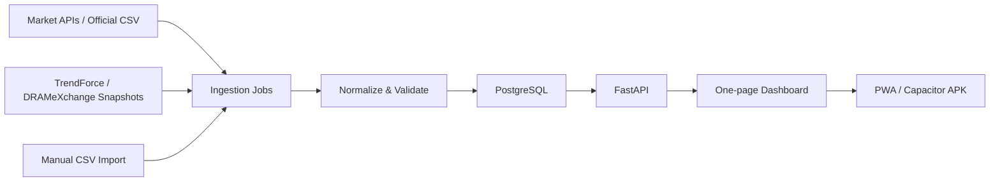

# 記憶體報價趨勢追蹤儀錶板 Implement Plan

日期：2026-06-23  
目標：打造一頁式記憶體產業趨勢儀錶板，核心聚焦 Memory / NAND / Flash / HBM / SSD 報價與直接曝險公司，整合美股、日股、韓股、台股記憶體供應鏈個股，以及 DRAM/NAND 報價趨勢，提供 1 週、1 個月、3 個月、6 個月、1 年變化與牛熊狀態評分。

> 注意：此系統用於產業追蹤與研究，不作為投資建議。價格資料需遵守各資料源授權、頻率限制與使用條款。

## 1. 核心範圍

### 追蹤標的

追蹤宇宙分層：
- Tier A：核心 Memory / NAND / Flash / HBM / SSD，直接反映記憶體報價與供需，是預設視圖與牛熊總分主體。
- Tier B：記憶體控制 IC、介面 IP、模組、封測、載板、材料、記憶體相關設備，作為供應鏈廣度與領先/落後指標。
- Tier C：下游儲存系統、HDD、資料中心儲存、一般半導體設備/材料，僅作背景觀察，不直接納入核心牛熊分數。

重要邊界：
- 本儀錶板不是整個半導體大盤追蹤器。
- 預設畫面、總分、熱力圖與排行榜都以記憶體/NAND/Flash 直接曝險為主。
- 設備、材料、封測、載板、EDA、下游儲存只在「供應鏈觀察」分頁或輔助指標中呈現。

美股核心記憶體與儲存：
- Micron：`MU`，DRAM、NAND、HBM
- Sandisk：`SNDK`，NAND Flash、SSD、flash storage
- Western Digital：`WDC`，2025 年分拆 Sandisk 後偏 HDD/儲存設備，列為需求端與儲存鏈觀察

美股控制 IC / IP / 連接：
- Silicon Motion / 慧榮：`SIMO`，NAND Flash / SSD / eMMC / UFS 控制 IC
- Rambus：`RMBS`，DDR/HBM/CXL 等記憶體介面晶片與 IP
- Marvell：`MRVL`，資料中心儲存、網通與客製 ASIC，受 AI 儲存/記憶體頻寬需求影響
- Broadcom：`AVGO`，資料中心連接、交換器、客製 ASIC，作為 AI 記憶體頻寬需求觀察
- Cadence：`CDNS`，EDA / IP，含記憶體介面與高速連接 IP
- Synopsys：`SNPS`，EDA / IP，含 DDR/HBM/PCIe/CXL 相關 IP

美股設備 / 材料 / 封測 / 測試：
- Applied Materials：`AMAT`，薄膜、蝕刻、量測等晶圓製程設備
- Lam Research：`LRCX`，蝕刻、沉積、清洗，記憶體高深寬比製程重要設備商
- KLA：`KLAC`，製程控制、檢測與量測
- Teradyne：`TER`，半導體測試設備
- FormFactor：`FORM`，探針卡與晶圓測試
- Cohu：`COHU`，測試與 handler
- Amkor：`AMKR`，封裝測試，先進封裝觀察
- Entegris：`ENTG`，半導體材料、過濾、化學品供應
- MKS Instruments：`MKSI`，製程子系統、化學品與設備零組件
- Onto Innovation：`ONTO`，量測、檢測、先進封裝製程控制
- Axcelis：`ACLS`，離子佈植設備
- Veeco：`VECO`，薄膜與雷射退火等設備
- Photronics：`PLAB`，光罩

美股下游儲存需求觀察：
- Seagate：`STX`，HDD / nearline data center storage
- Pure Storage：`PSTG`，企業級 all-flash storage
- Kingston：未上市，無股票行情；可追蹤公司新聞、通路價格或模組報價替代

韓股核心記憶體：
- Samsung Electronics：`005930.KS`，DRAM、NAND、HBM
- SK hynix：`000660.KS`，DRAM、NAND、HBM

韓股設備 / 材料 / 封測 / 載板 / 測試觀察：
- Wonik IPS：`240810.KQ`，半導體沉積/熱處理設備
- PSK：`319660.KQ`，photoresist strip / dry cleaning 等設備
- PSK Holdings：`031980.KQ`，半導體設備控股
- Eugene Technology：`084370.KQ`，沉積與製程設備
- TES：`095610.KQ`，半導體製程設備
- Simmtech：`222800.KQ`，記憶體模組 PCB / 封裝基板
- ISC：`095340.KQ`，半導體測試 socket
- Leeno Industrial：`058470.KQ`，測試 pin / socket
- Hana Micron：`067310.KQ`，半導體封測
- SFA Semicon：`036540.KQ`，半導體封測
- Nepes：`033640.KQ`，封裝與材料
- TSE：`131290.KQ`，測試介面、probe card、socket
- Exicon：`092870.KQ`，半導體測試設備
- Soulbrain：`357780.KQ`，半導體製程化學品
- Dongjin Semichem：`005290.KQ`，photoresist / wet chemical
- Hansol Chemical：`014680.KS`，半導體化學材料
- Wonik Materials：`104830.KQ`，特殊氣體
- DNF：`092070.KQ`，半導體前驅物材料
- Foosung：`093370.KS`，特殊氣體與化學材料

日股核心記憶體：
- Kioxia Holdings：`285A.T`，NAND Flash / SSD

日股設備 / 材料 / 光罩 / 載板 / 測試觀察：
- Advantest：`6857.T`，記憶體/SoC 測試設備，HBM 測試需求指標
- Tokyo Electron：`8035.T`，塗佈顯影、蝕刻、沉積、清洗等製程設備
- SCREEN Holdings：`7735.T`，清洗、塗佈顯影等設備
- DISCO：`6146.T`，晶圓切割、研磨、薄化設備
- Lasertec：`6920.T`，EUV 光罩檢測
- Ebara：`6361.T`，CMP / 真空泵等設備
- Nikon：`7731.T`，半導體曝光設備
- Canon：`7751.T`，半導體曝光設備
- ULVAC：`6728.T`，真空與薄膜製程設備
- Shibaura Mechatronics：`6590.T`，晶圓清洗、封裝/顯示設備
- SUMCO：`3436.T`，矽晶圓
- Shin-Etsu Chemical：`4063.T`，矽晶圓、photoresist、半導體材料
- Resonac：`4004.T`，封裝材料、CMP slurry、半導體材料
- Tokyo Ohka Kogyo：`4186.T`，photoresist / 高純度化學品
- Fujifilm：`4901.T`，photoresist、CMP slurry、半導體材料
- HOYA：`7741.T`，光罩 blanks、EUV mask blanks
- Ibiden：`4062.T`，IC 載板
- Toppan Holdings：`7911.T`，光罩、半導體相關材料
- Dai Nippon Printing：`7912.T`，光罩、封裝材料
- ADEKA：`4401.T`，半導體前驅物與化學材料
- Air Water：`4088.T`，工業氣體與半導體材料

台股核心記憶體 / 控制 IC / 模組：
- 南亞科：`2408.TW`，DRAM
- 華邦電：`2344.TW`，Specialty DRAM、NOR Flash、SLC NAND
- 力積電：`6770.TW`，DRAM / memory foundry / 晶圓代工
- 晶豪科：`3006.TW`，利基型記憶體 IC
- 旺宏：`2337.TW`，NOR Flash、ROM、NAND 相關
- 群聯：`8299.TWO`，NAND controller、SSD solution
- 創見：`2451.TW`，記憶體模組、SSD、工控儲存
- 威剛：`3260.TWO`，記憶體模組、SSD
- 十銓：`4967.TWO`，記憶體模組、SSD
- 宜鼎：`5289.TWO`，工控記憶體、SSD
- 宇瞻：`8271.TWO`，記憶體模組、SSD
- 品安：`8088.TWO`，記憶體模組/儲存產品

台股控制 IC / IP / 設計服務觀察：
- 安國：`8054.TWO`，USB / flash storage controller 相關 IC
- 創惟：`6104.TW`，USB 控制 IC，與外接儲存周邊鏈結較高
- 力旺：`3529.TWO`，嵌入式非揮發性記憶體 IP
- 世芯-KY：`3661.TW`，ASIC 設計服務，AI/HBM 需求間接受惠，列觀察

台股封測 / 測試 / 探針卡 / 載板觀察：
- 力成：`6239.TW`，記憶體封測
- 南茂：`8150.TW`，記憶體與驅動 IC 封測
- 京元電子：`2449.TW`，半導體測試
- 矽格：`6257.TW`，半導體測試與封裝
- 華東：`8110.TW`，記憶體封裝測試
- 日月光投控：`3711.TW`，封測與先進封裝
- 欣銓：`3264.TWO`，晶圓測試
- 穎崴：`6515.TW`，測試座、probe head、測試介面
- 中華精測：`6510.TW`，探針卡、測試介面
- 旺矽：`6223.TWO`，probe card、測試介面
- 雍智科技：`6683.TWO`，測試載板與介面
- 欣興：`3037.TW`，IC 載板
- 景碩：`3189.TW`，IC 載板
- 南電：`8046.TW`，IC 載板

台股設備 / 材料觀察：
- 環球晶：`6488.TWO`，矽晶圓
- 中美晶：`5483.TWO`，矽晶圓控股/材料鏈
- 台勝科：`3532.TW`，矽晶圓
- 家登：`3680.TWO`，晶圓傳載、光罩載具
- 弘塑：`3131.TWO`，濕製程設備
- 辛耘：`3583.TW`，再生晶圓、設備代理、製程服務
- 帆宣：`6196.TW`，廠務工程與設備整合
- 漢唐：`2404.TW`，半導體廠務工程
- 崇越：`5434.TWO`，半導體材料通路與設備

報價趨勢：
- DRAM：DDR2、DDR3、DDR4、DDR5 spot/contract/module price
- NAND：Flash spot、wafer spot、SSD contract/street price、eMMC/UFS
- 優先使用 TrendForce / DRAMeXchange 類別資料；若完整歷史資料需付費，MVP 先每日保存公開快照，逐日累積自己的歷史資料。

## 2. 資料源可行性

### 股票行情

建議採混合來源，避免單一免費 API 失效：

| 市場 | 優先資料源 | 備援資料源 | 備註 |
|---|---|---|---|
| 台股上市 | FinMind `TaiwanStockPrice` / TWSE 官方每日個股資料 | yfinance / Stooq | FinMind 可一次用同一套 API 處理上市、上櫃、興櫃；TWSE 頁面提供 2010-01-04 起資料與 CSV 下載。 |
| 台股上櫃 | FinMind `TaiwanStockPrice` / TPEx 官方資料 | yfinance | 群聯、威剛、宜鼎、宇瞻等需要 TPEx 或 FinMind 統一處理。 |
| 美股 | Alpha Vantage free key、Stooq CSV 或 FinMind `USStockPrice` | yfinance | Alpha Vantage 免費 key 有流量限制；FinMind 也提供美股日線，但仍需驗證 MU 等標的覆蓋與額度。 |
| 日股 | Stooq / yfinance / 付費或券商 API | 手動匯入 CSV | Kioxia 與日本半導體設備股需在 Phase 0 驗證可抓日線與代號格式。 |
| 韓股 | KRX 資料頁或 yfinance/Stooq | 手動匯入 CSV | KRX 官方站可查資料，但免費穩定 API 需再驗證；MVP 可先使用 yfinance/Stooq。 |

### FinMind 導入策略

FinMind 可以納入，而且建議作為 MVP 的台股主要整合來源之一：

- `TaiwanStockInfo`：取得台灣上市、上櫃、興櫃股票名稱、代碼、產業類別與市場別，可用來確認追蹤清單與市場分類。
- `TaiwanStockTradingDate`：取得台股交易日曆，方便計算 1W/1M/3M/6M/1Y 期間與補資料。
- `TaiwanStockPrice`：取得台股日成交資訊，涵蓋上市、上櫃、興櫃，資料區間官方文件標示為 `1994-10-01 ~ now`。
- `USStockInfo` / `USStockPrice`：可作為美股清單與日線資料來源之一，需在 Phase 0 驗證 MU、SNDK、WDC、SIMO、RMBS、MRVL、AVGO、AMAT、LRCX、KLAC、STX、PSTG 等代號覆蓋率。
- API 端點：`https://api.finmindtrade.com/api/v4/data`
- 認證：使用 Bearer token，建議以環境變數 `FINMIND_TOKEN` 管理，不寫入程式碼或 repo。
- 額度：FinMind 文件提供使用次數查詢 API，超過上限會回傳 HTTP `402`；實作需加入用量檢查、快取與 retry/backoff。

MVP 優先順序建議：

1. 台股：先用 FinMind 拉 `TaiwanStockInfo` + `TaiwanStockPrice`，官方 TWSE/TPEx 作為備援或交叉驗證。
2. 美股：先同時驗證 FinMind `USStockPrice`、Stooq、Alpha Vantage；若 FinMind 覆蓋足夠，可減少 API 種類。
3. 日股：先驗證 Stooq/yfinance 對 `285A.T`、`6857.T`、`8035.T` 等日股代號的可用性；若免費源不穩，採手動 CSV 或券商 API。
4. 韓股：FinMind 目前不是主要選項，仍以 KRX/yfinance/Stooq 驗證為主。

### TrendForce / DRAMeXchange

可行但需要分級處理：

1. 公開頁可見即時/近期價格表，例如 DRAM spot、NAND flash spot、module spot、wafer spot 等，適合做「每日快照」。
2. 歷史圖表、完整 DDR2-DDR5、NAND 全品項、合約價與研究資料，很可能需要會員或授權。若使用付費帳號，應採正式登入、匯出或 API 方式，不建議繞過限制。
3. 若無付費授權，系統仍可從上線日開始每天記錄公開項目，逐步建立 1W/1M/1Y 趨勢；歷史回補則只能使用合法可下載資料或人工 CSV 匯入。

### 免費 API / 爬蟲策略

MVP 建議：
- 股票資料：先用可穩定批次抓取的免費資料源，存入本地資料庫。
- TrendForce/DRAMeXchange：以公開頁表格快照為主，設定低頻率排程，例如每日台北時間 18:30 後抓一次。
- 新聞與事件：第二階段再加入 RSS/news API，用於解釋趨勢變化。
- 所有爬蟲加上 User-Agent、重試、快取、頻率限制、來源記錄與失敗告警。

### 資料更新機制

系統需支援三種更新觸發：

1. App/Web UI 開啟時自動檢查更新
   - Web UI 或 Android app 啟動後呼叫 Backend/API 檢查 `source_runs` 與最新資料時間。
   - 若資料超過設定的新鮮度門檻，例如股票日線超過 12 小時、報價快照超過 24 小時，顯示可更新狀態。
   - 預設可自動觸發輕量增量更新；若資料源限流風險高，則提示使用者按手動更新。

2. 手動按下「更新」按鈕
   - Web UI 與 Android app 都提供更新按鈕。
   - 後端建立一個 `refresh_all` job，抓取所有最新股票日線、記憶體報價、供應鏈指標與資料源狀態。
   - UI 顯示更新進度、成功/失敗來源、最後更新時間。

3. 每日背景更新
   - 每天台北時間 `01:00` 執行背景排程，抓取所有資料源可取得的最新資料。
   - 若部分資料源在 01:00 尚未更新，例如台股或 TrendForce 當日資料，可標記為 `not_ready`，並在下一次開啟或手動更新時補抓。
   - 排程使用 APScheduler / Celery Beat；部署時由 Backend service 啟動 scheduler，或獨立 `worker` container 執行。

更新安全規則：
- 所有更新 job 需有 lock，避免手動更新與背景更新同時執行。
- 優先做增量更新，只抓最後成功日期之後的資料。
- 每個資料源獨立記錄狀態，不因單一來源失敗中斷全部更新。
- 寫入 PostgreSQL 時使用 upsert，避免重複資料。
- 每次更新寫入 `source_runs`，包含觸發來源：`startup`、`manual`、`scheduled_0100`。
- 失敗需支援 retry/backoff，並在 UI 顯示可讀錯誤訊息。

## 3. 系統架構

建議技術棧：
- Backend：Python FastAPI
- Scheduler：APScheduler 或 Celery Beat
- Crawler：requests/httpx + BeautifulSoup；必要時 Playwright
- Database：PostgreSQL 作為正式資料庫；本機開發可用 Docker Compose 啟動
- Frontend：React + Vite + TypeScript
- Chart：Apache ECharts 或 Recharts
- Mobile：Android app 作為正式支援目標；先以 PWA 驗證，再用 Capacitor 打包 APK

服務埠規劃：
- Backend/API：`3000`
- Web UI 入口：`8510`
- PostgreSQL：正式資料庫服務；若使用 Docker Compose，預設容器內 `5432`，對外映射埠可在部署前確認

資料流：



## 4. 資料模型草案

主要資料表：
- `instruments`：股票/報價品項主檔，含市場、代號、分類、幣別、是否啟用。
- `instrument_tags`：供應鏈標籤，例如 `memory-maker`、`nand-controller`、`module-brand`、`equipment`、`material`、`backend-test`、`substrate`、`downstream-storage`、`tier-a/b/c`。
- `instrument_score_config`：設定是否納入核心牛熊分數、供應鏈廣度分數或只做觀察。
- `equity_prices`：股票 OHLCV 日線。
- `memory_quotes`：DRAM/NAND 報價快照，含品項、high、low、average、change_pct、來源、抓取時間。
- `trend_metrics`：預先計算 1W/1M/3M/6M/1Y 報酬、波動、均線、相對強弱。
- `market_scores`：牛熊分數、分項分數、狀態標籤。
- `source_runs`：每次抓取狀態、錯誤訊息、資料筆數。
- `refresh_jobs`：更新任務狀態，含觸發來源、開始/結束時間、目前進度、lock key、成功/失敗統計。

## 5. 牛熊市狀態評分

以 0-100 分呈現，並用五段狀態：
- 0-20：強熊
- 21-40：偏熊
- 41-60：中性
- 61-80：偏牛
- 81-100：強牛

建議分數組成：

| 模組 | 權重 | 說明 |
|---|---:|---|
| 記憶體報價動能 | 40% | DRAM、NAND、Flash、HBM、SSD 相關報價的 1W、1M、3M 漲跌與均線方向。 |
| 核心記憶體股價動能 | 25% | 僅納入 Tier A 與高直接曝險標的，例如 MU、SNDK、Samsung、SK hynix、Kioxia、南亞科、華邦電、旺宏、群聯等。 |
| 記憶體供應鏈廣度 | 10% | Tier A/B 中多少記憶體直接相關股票站上 20D/60D 均線；設備/材料僅低權重輔助。 |
| 波動與回撤 | 15% | 波動越高、最大回撤越大則扣分。 |
| 相對強弱 | 10% | 記憶體籃子相對 Nasdaq、KOSPI、TAIEX 或 SOXX。 |

初版公式：

```text
score = 50
      + quote_momentum_score * 0.35
      + equity_momentum_score * 0.25
      + breadth_score * 0.15
      + risk_score * 0.15
      + relative_strength_score * 0.10
```

分數要能展開顯示原因，例如「DDR5 spot 1M +12%、NAND wafer 1M -3%、台股模組股 70% 站上 60D」。

總分排除規則：
- 一般半導體設備、材料、EDA、封測、載板、下游儲存不得直接主導牛熊總分。
- AMAT、LRCX、TEL、Advantest、GlobalWafers、日月光、欣興等標的只可作為供應鏈輔助、領先/落後或風險提示。
- 若要看整體半導體景氣，可在「供應鏈觀察」分頁獨立呈現，不混入 Memory / NAND / Flash 核心分數。

## 6. 一頁式儀錶板佈局

第一螢幕資訊密度要高，不做行銷首頁。

預設視圖：
- 預設為「核心記憶體」視圖，只呈現 DRAM / NAND / Flash / HBM / SSD 報價與 Tier A / 高直接曝險股票。
- 「供應鏈觀察」作為可切換分頁，才顯示設備、材料、封測、載板、EDA、下游儲存等背景指標。
- 全站文案與圖表標題避免泛稱「半導體景氣」，統一聚焦「記憶體/NAND/Flash 趨勢」。

區塊建議：

1. 頂部狀態列
   - 總牛熊分數
   - 最新更新時間
   - DRAM 指標、NAND 指標、股票籃子指標
   - 1W / 1M / 3M / 6M / 1Y 快速切換

2. 大趨勢圖
   - 左軸：標準化記憶體報價指數
   - 右軸：記憶體股票籃子指數
   - 可切換 DRAM、NAND、股票、全部

3. 報價熱力表
   - DDR2-DDR5、LPDDR、GDDR、NAND wafer、SSD、eMMC/UFS
   - 顏色呈現 1W/1M/1Y 變化
   - 點擊後展開該品項時間圖

4. 股票追蹤表
   - 依市場分組：美股、韓股、台股、模組/販售端
   - 欄位：最新價、1W、1M、3M、1Y、成交量變化、均線狀態、相對強弱

5. 領先/落後排行榜
   - 報價品項 Top movers
   - 股票 Top movers
   - 異常波動提示

6. 資料品質與來源狀態
   - 哪些資料源成功/失敗
   - 最後抓取時間
   - 是否有人工匯入資料
   - 更新按鈕與更新進度
   - 顯示每日 01:00 背景更新是否成功

7. Web UI 查詢功能
   - Web UI 入口固定為 `http://localhost:8510`
   - 可查詢 PostgreSQL 內的股票日線、記憶體報價、供應鏈分類、牛熊分數、資料源抓取紀錄
   - 支援市場、Tier、供應鏈分類、股票代號、日期區間、資料源狀態篩選
   - 支援表格排序、搜尋、CSV 匯出
   - 查詢 API 由 Backend/API `http://localhost:3000` 提供

## 7. Android App / APK 支援

Android app 列為正式支援目標，而不是事後附加功能。建議路線：

1. 先做 Web/PWA
   - 桌機與手機瀏覽器都能使用
   - 可加到 Android 主畫面
   - 最快驗證資料與 UI

2. 再用 Capacitor 打包 APK
   - React/Vite 前端可直接封裝
   - 後端可選：
     - 雲端/家中伺服器：APK 連線到 API，最穩定
     - 本機離線快取：APP 內只保存最近資料，不負責爬蟲

3. 不建議第一版把爬蟲放在 Android 裡
   - 背景排程不穩定
   - 容易被資料源擋
   - 認證與資料庫維護較麻煩

## 8. 實作階段

### Phase 0：資料源驗證與代號確認

產出：
- 確認所有股票代號
- 確認 FinMind、TWSE、TPEx、美股、日股、韓股資料源可抓最近 1 年日線
- 驗證台、美、日、韓完整記憶體供應鏈股票宇宙的代號、上市市場、是否仍上市、資料源覆蓋率
- 驗證 FinMind `TaiwanStockPrice` 是否能覆蓋全部台股記憶體、模組、控制 IC、封測、材料、設備標的
- 驗證 FinMind `USStockPrice` 是否能覆蓋 MU、SNDK、WDC、SIMO、RMBS、MRVL、AVGO、AMAT、LRCX、KLAC 等美股標的
- 驗證日股資料源是否能覆蓋 Kioxia `285A.T` 及日本半導體設備/材料/載板/光罩觀察股
- 驗證韓股資料源是否能覆蓋 Samsung、SK hynix，以及韓國設備、材料、封測、載板、測試介面觀察股
- 為每個標的設定 `tier`、供應鏈分類、核心分數權重、是否只做觀察
- 確認 TrendForce/DRAMeXchange 公開欄位可抓項目
- 產出資料源可用性報告

### Phase 1：MVP 資料管線

產出：
- FastAPI 專案骨架
- PostgreSQL schema
- Docker Compose：PostgreSQL、Backend/API `3000`、Web UI `8510`
- 股票日線抓取 jobs：FinMind 台股優先，美股視驗證結果使用 FinMind/Stooq/Alpha Vantage，日股使用 Stooq/yfinance 或手動 CSV 備援
- DRAM/NAND 公開快照 job
- 每日 `01:00` 背景更新 scheduler
- 手動更新 API：`POST /api/refresh`
- 更新狀態 API：`GET /api/refresh/status`
- 開啟時檢查更新 API：`GET /api/refresh/health`
- 基礎 API：`/api/instruments`、`/api/prices`、`/api/quotes`、`/api/score`

### Phase 2：一頁式 Dashboard

產出：
- React/Vite 前端
- 趨勢圖、熱力表、股票表、牛熊分數
- Web UI 查詢頁：查詢 PostgreSQL 資料、篩選市場/Tier/供應鏈分類/日期區間、CSV 匯出
- Web UI 入口固定 `8510`
- 開啟頁面時檢查資料新鮮度，必要時提示或觸發更新
- 手動「更新全部資料」按鈕與進度顯示
- RWD 手機版
- 資料源狀態提示

### Phase 3：評分與告警

產出：
- 牛熊分數可解釋化
- 異常漲跌提示
- 追蹤清單自訂
- 匯出 CSV/PNG

### Phase 4：PWA / Android APK

產出：
- PWA manifest、離線快取
- Capacitor Android 專案
- Debug APK
- Android app 支援連線 Backend/API `3000`，呈現與 Web UI 一致的查詢、趨勢、熱力表與牛熊分數
- Android app 開啟時檢查資料新鮮度，手動更新由後端執行
- 背景更新以伺服器端 `01:00` scheduler 為主，不依賴 Android 背景工作
- 後續若需上架 Play Store，再補 signing 與隱私政策

## 9. 需要先確認的細節

1. TrendForce/DRAMeXchange 是否有付費帳號或可合法匯出歷史資料？
2. 儀錶板只給自己使用，還是要部署成可多人使用的網站？
3. 報價資料是否接受「從上線後開始累積歷史」，或一定要回補過去 1 年？

## 10. 主要風險

- TrendForce 完整資料可能需要授權，不能假設能免費抓到所有歷史。
- 免費股票 API 可能有延遲、限流或格式變更。
- 韓股官方資料源自動化抓取穩定性需驗證。
- Android APK 若要離線保存大量歷史資料，需要額外設計同步與快取策略。
- 多市場幣別與交易日不同，需要統一日曆與匯率處理。
- 供應鏈股票宇宙擴大後，設備、材料、封測、下游儲存可能更接近「半導體景氣」而非「記憶體/NAND/Flash 報價」；核心牛熊分數必須限制在 Tier A 與高直接曝險標的，其餘只能作為廣度、熱度與領先/落後觀察。

## 11. 參考來源

- TrendForce 官方站列出 DRAM、NAND Flash、Price Trends、Membership 與研究分類：https://www.trendforce.com/
- DRAMeXchange 公開頁列出 DRAM Spot Price、NAND Flash Spot Price、Module Spot Price、Wafer Spot Price 等表格與更新時間：https://www.dramexchange.com/
- TWSE 個股日成交資訊頁註明資料自 2010-01-04 起提供，並提供 CSV 下載：https://www.twse.com.tw/en/trading/historical/stock-day.html
- Alpha Vantage 官方文件提供 daily/weekly/monthly time series、ticker quote、global equity data 與 free API key 說明：https://www.alphavantage.co/documentation/
- Stooq historical data download 頁：https://stooq.com/db/h/
- FinMind 總覽說明其提供以台股為主、超過 50 種金融開源資料，並包含美股日線等國際市場資料：https://finmind.github.io/
- FinMind 台股技術面文件列出 `TaiwanStockInfo`、`TaiwanStockTradingDate`、`TaiwanStockPrice` 等資料集：https://finmind.github.io/tutor/TaiwanMarket/Technical/
- FinMind 美股技術面文件列出 `USStockInfo`、`USStockPrice` 等資料集：https://finmind.github.io/tutor/UnitedStatesMarket/Technical/
- FinMind API 使用次數文件說明可查詢使用量與上限，超過上限會回傳 HTTP 402：https://finmind.github.io/api_usage_count/
- Kioxia Holdings IR 頁顯示 TSE Prime 代號 `285A`：https://www.kioxia-holdings.com/en-jp/ir.html
- Silicon Motion IR/產品頁列出 SSD controllers、UFS/eMMC、flash card、USB flash drive controllers 等產品線：https://ir.siliconmotion.com/
- Sandisk 公司/投資人頁：https://www.sandisk.com/company/investor-relations.html
- Lam Research 官方產品導覽列出 DRAM、deposition、etch、strip & clean、advanced packaging 等半導體製程方案：https://www.lamresearch.com/company/
- GlobalWafers 官方站列出 silicon ingot、polished wafer、epitaxial wafer、SOI wafer 等矽晶圓產品：https://www.sas-globalwafers.com/en/
- Phison 官方站與公司資料說明其 NAND flash controller、SSD solution 產品定位：https://www.phison.com/en/

## 12. 建議決策

建議先做 Phase 0 + Phase 1，不急著打包 APK。原因是這個產品成敗主要在資料源可靠度與報價歷史累積；一旦資料管線穩定，前端與 APK 都是可控工程。

第一個可交付 MVP：
- PostgreSQL 資料庫
- Backend/API：`http://localhost:3000`
- Web UI Dashboard / 查詢入口：`http://localhost:8510`
- 追蹤上述股票最近 1 年日線
- 每日保存 DRAM/NAND 公開快照
- 每天台北時間 `01:00` 背景抓取所有最新資料
- App/Web UI 開啟時檢查資料新鮮度
- Web UI / Android app 手動更新所有資料
- 顯示 1W/1M/3M/6M/1Y 變化
- 顯示 0-100 牛熊分數與原因
- Android app 支援路線：PWA + Capacitor APK
